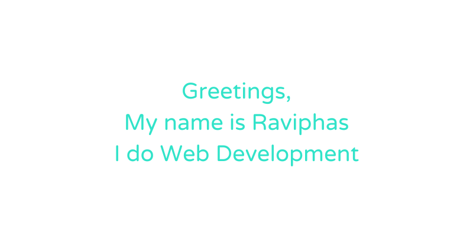

I'm a software developer from Thailand but based in the UK. 
I'm a third-year Software Engineering student at the University of Glasgow.

### Programming Languages I used
* TypeScript
* Python
* C/C++
* Java

### Frameworks & Libaries I used
* React
* Angular
* NestJS
* Qt
* Tailwind CSS

### About me
I started learning about software development in 2020 and immensely enjoyed it. 

While studying at KMITL, I produced at least three large projects for academic and personal purposes.
Each project improved my coding technique and time management as a developer.

In the past, I worked as a C programming course Teacher assistant in 2021 and interned as a Full stack developer at PRIMO in the summer of 2022.

I am looking for a place to intern in the summer of 2023. I will use this opportunity to look for a company I will consider working for after graduation.
